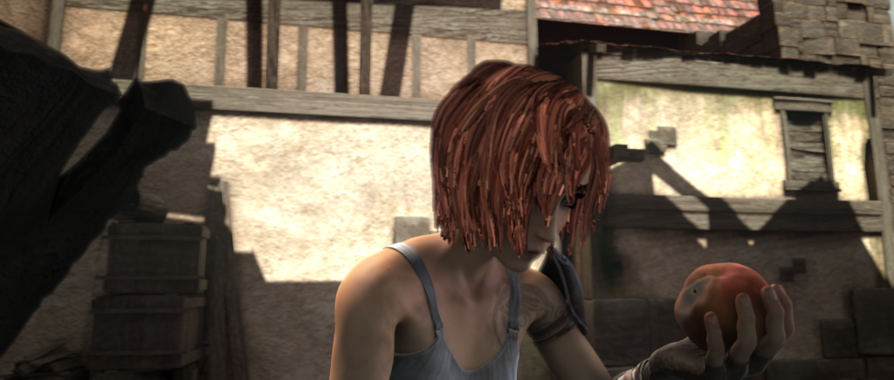
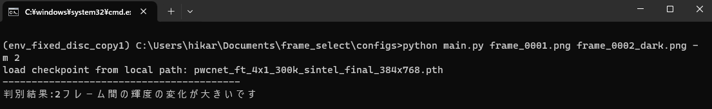
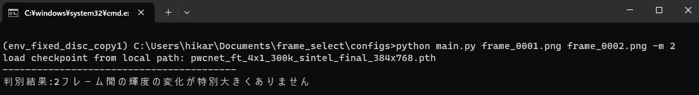
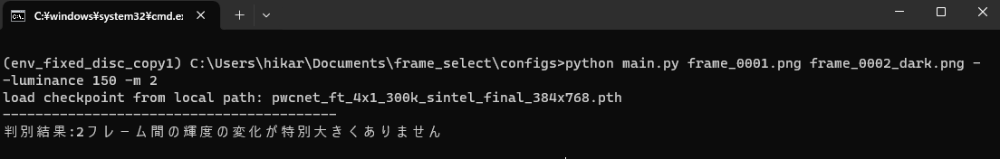
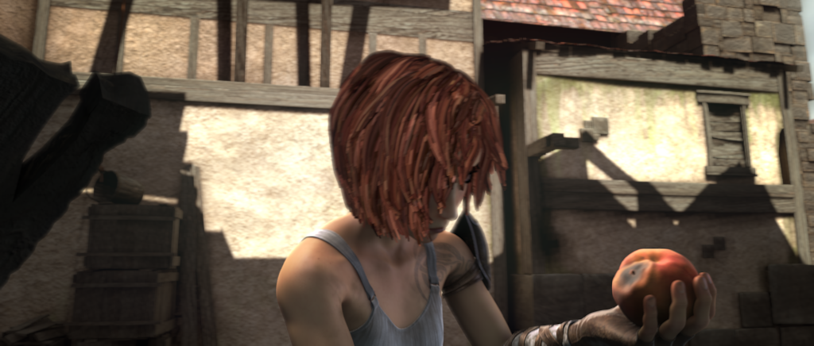
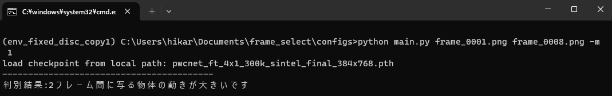
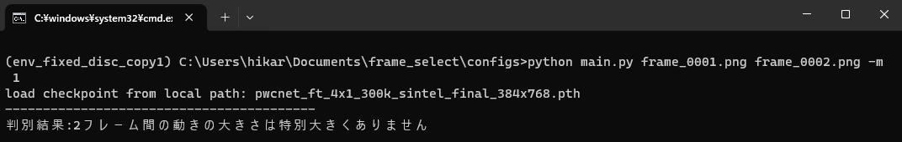
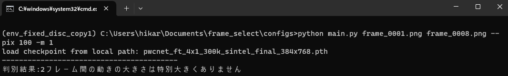

## このアプリケーションについての説明
このコードは以下の2つのアプリケーションが内蔵されている。
- 時間的に連続した2つの画像に大きな輝度変化(明るさの変化)がある場合に検知するアプリケーション
- 時間的に連続した2つの画像のオブジェクトが大きく動く場合に検知するアプリケーション

 

## 時間的に連続した2つの画像に大きな輝度変化(明るさの変化)がある場合に検知するアプリケーション

### 入力画像例

以下のような時間的に連続した2つの画像を入力とする
||||
|---|---|---|
|(a) 輝度変化が大きい時間的に連続な2つの画像|||
|ファイル名|frame_0001.png|frame_0002_dark.png|
|(b) 輝度変化が大きくない時間的に連続な2つの画像|||
|ファイル名|frame_0001.png|frame_0002.png|

gifで表示すると以下のようになる
|(a) 輝度変化の大きい|(b) 輝度変化の小さい|
|---|---|
|||

### 実行例①
上記(a)の二枚の画像は「輝度変化が大きい」ためアプリケーションに入力すると”2フレーム間の輝度の変化が大きいです”と出力される。  

対して、上記(b)の二枚の画像は「輝度変化が小さい」ためアプリケーションに入力すると”2フレーム間の輝度の変化が特別大きくありません”と出力される

### 実行例②
また、パラメータを指定することで、許容する輝度変化の大きさを制御できる。  
以下の例では、パラメータにより大きな輝度変化を許容するように変更したことで上記の(a)の2枚の画像を入力しても”2フレーム間の輝度の変化が特別大きくありません”と判定されるようになった。

 

## 時間的に連続した2つの画像のオブジェクトが大きく動く場合に検知するアプリケーション

### 入力画像例

以下のような時間的に連続した2つの画像を入力とする
||||
|---|---|---|
|(c) オブジェクトの動きが大きい時間的に連続な2つの画像|||
|ファイル名|frame_0001.png|frame_0008.png|
|(d) オブジェクトの動きが小さい時間的に連続な2つの画像|||
|ファイル名|frame_0001.png|frame_0002.png|

gifで表示すると以下のようになる
|(c) 動きが大きい|(d) 動きが小さい|
|---|---|
|||

### 実行例①
上記(c)の二枚の画像は画像内の「オブジェクトが大きく動く」ためアプリケーションに入力すると”2フレーム間に写る物体の動きが大きいです”と出力される。 

対して、上記(d)の二枚の画像は画像内の「オブジェクトが小さく動く」ためアプリケーションに入力すると”2フレーム間の動きの大きさは特別大きくありません”と出力される。

### 実行例②
また、こちらもパラメータを指定することで、許容するオブジェクトの動きの大きさを制御できる。  
以下の例では、パラメータにより大きな動きを許容するように変更したことで上記の(c)の2枚の画像を入力しても”2フレーム間の動きの大きさは特別大きくありません”と判定されるようになった。

